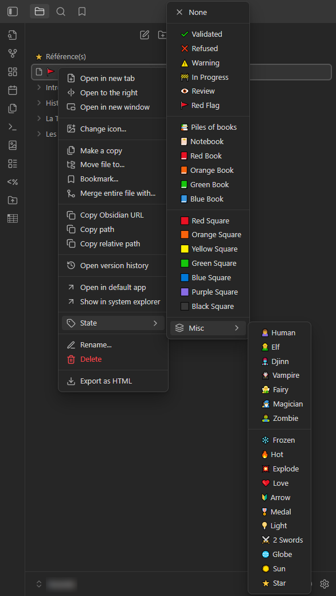

# Note & Folder State Icons *for Obsidian*

**Note & Folder State Icons** is an open-source plugin for Obsidian that allows you to assign a **visual state indicator** to notes and folders using **additional icons displayed in the File Explorer**.

This plugin is designed to provide **clear, immediate visual cues** about the editorial or semantic state of a note or folder (draft, review, validated, etc.), **without altering the note content, metadata, or file structure**.

It does **not** replace tags, properties, or folder organization.  
It complements them with a lightweight visual layer.

---

## ✨ Features

- Assign an **icon-based state** to any note or folder
- Icons are displayed **exclusively in the File Explorer**
- Does **not** modify:
  - note content
  - frontmatter
  - file names
  - native Obsidian icons
- States are **persistent** across Obsidian restarts
- Designed to remain efficient with large vaults
- Lightweight, non-intrusive behavior
- Desktop-focused UI integration

---

## 🧠 How It Works

1. Right-click a note or folder in the File Explorer
2. Open the **State** menu
3. Select an icon from the list
4. The selected icon appears **to the left of the note or folder title**

To remove a state, choose **None**.

All states are stored internally and automatically restored when Obsidian is restarted.

---

## 🗂 Available States (default)

States are currently defined directly in the plugin source.  
Each state consists of:
- an icon
- a label
- a color (currently uniform)

### Validation & Status
- ✔ Validated  
- ❌ Refused  
- ⚠️ Warning  
- 🚧 In Progress  
- 👁 Review  
- 🚩 Red Flag  

### Books & Documents
- 📚 Piles of books  
- 📔 Notebook  
- 📕 Red Book  
- 📙 Orange Book  
- 📗 Green Book  
- 📘 Blue Book  

### Visual Markers
- 🟥 Red Square  
- 🟧 Orange Square  
- 🟨 Yellow Square  
- 🟩 Green Square  
- 🟦 Blue Square  
- 🟪 Purple Square  
- ⬛ Black Square  

### Species
- 🙍 Human  
- 🧝 Elf  
- 🧞 Djinn  
- 🧛 Vampire  
- 🧚 Fairy  
- 🧙 Magician  
- 🧟️ Zombie  

### Miscellaneous
- ❄️ Frozen  
- 🔥 Hot  
- 💥 Explode  
- ❤️ Love  
- 🔰 Arrow  
- 🎖️ Medal  
- 💡 Light  
- ⚔️ 2 Swords  
- 🌐 Globe  
- 🔅 Sun  
- ⭐ Star  

The list can be freely modified or extended by editing the plugin source code.

---

## 🌍 Language Support

- 🇬🇧 English  
- 🇫🇷 Français  

---

## 🖥 Compatibility

| Platform | Supported |
|--------|-----------|
| Windows | ✅ |
| macOS | ✅ |
| Linux | ✅ |
| Android | ❌ |
| iOS | ❌ |

This plugin is **desktop-only**.

### Why desktop-only?
It relies on the desktop File Explorer and context menu system, which are not available on Obsidian Mobile.

---

## 🔒 Data & Privacy

- No network access
- No telemetry
- No external services
- All data is stored locally using Obsidian’s plugin data store

---

## 📦 Installation

### Manual Installation

1. Download or clone this repository
2. Copy the folder into:  
   `<YourVault>/.obsidian/plugins/obsidian-note-folder-state-icons`
3. Restart Obsidian
4. Enable **Note & Folder State Icons** in  
   `Settings → Community plugins`

---

## 🛠 Development Notes

- Written in JavaScript
- Built using Obsidian’s official Plugin API
- Adds state icons by injecting minimal DOM elements into the File Explorer
- Designed to be:
  - predictable
  - readable
  - easily extensible

---

## 📜 License

Released under the **MIT License**.

You are free to use, modify, redistribute, or integrate this plugin into other projects.

---

## 🤝 Contributing

Contributions, forks, and improvements are welcome.

This project intentionally remains simple and permissive.

---

## ✍️ Author

Initial implementation generated with AI assistance and refined manually.  
Maintained by **swefpifh**.

---

## 🛠 Changelog

### v0.1.6 | *2026/01/24*
- Fixed an issue where the icon remained visible during note or folder title editing and duplicated upon confirmation.

### v0.1.5 | *2026/01/12*
- Plugin renamed
- [QOL] Fixed state icons refresh on plugin enable/disable (no restart required)

### v0.1.4 | *2026/01/02*
- State icons can now be applied to folders
- New state icons added (*Human*)
- [QOL] Species and Misc icons grouped in a submenu

### v0.1.3 | *2026/01/01*
- New state icons added (*Elf, Djinn, Vampire, Magician, Zombie, Arrow, Medal, 2 Swords*)

### v0.1.2 | *2025/12/30*
- [QOL] Visual separators added between state groups

### v0.1.1 | *2025/12/30*
- English and French localization added

### v0.1.0 | *2025/12/29*
- Initial state system for note titles
